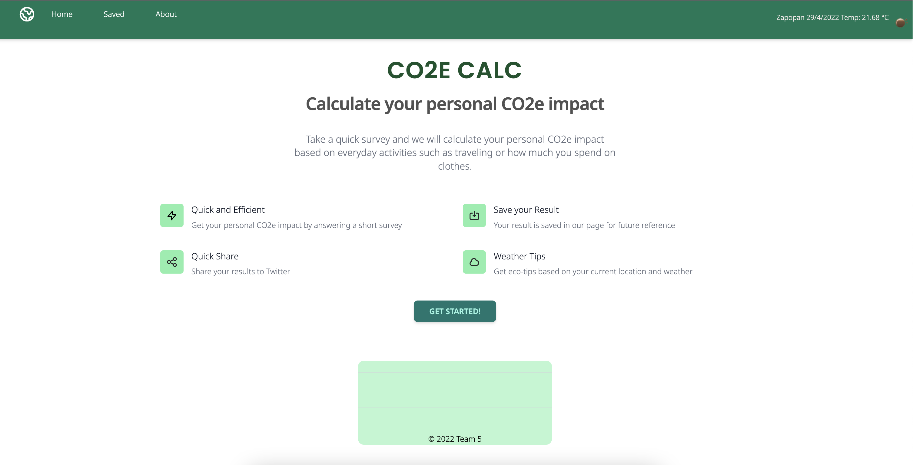
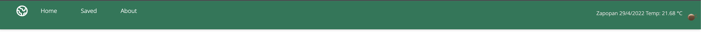
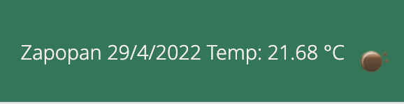
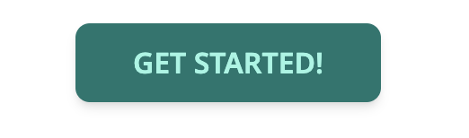
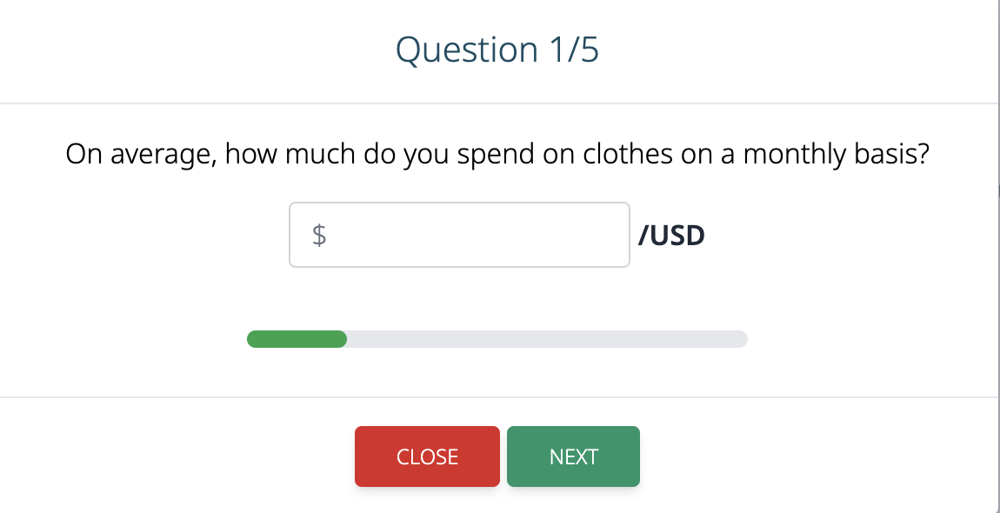
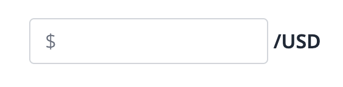
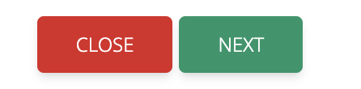
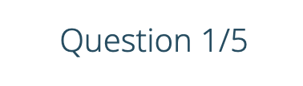
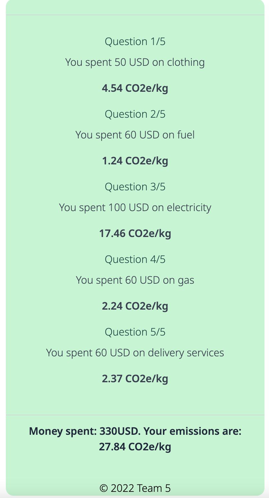
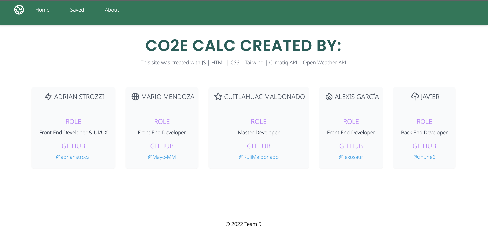

# **PROJECT 1 - CO2E PERSONAL CALC**

## DESCRIPTION:

> Welcome to the CO2e PERSONAL CALCULATOR. CO2e (Carbon Dioxide equivalent) is a metric measure that is used to compare emissions from various greenhouse gases. CO2e includes: carbon dioxide (CO2), methane (CH4), nitrous oxide (N2O), and the F-gases: hydrofluorocarbons (HFCs), perfluorocarbons (PFCs), sulfur hexafluoride (SF6), and nitrogen trifluoride (NF3). With CO2e Calc, you will be able to get a quick estimate on your personal CO2e impact by answering a short survey on how much do you spend on everyday activities such as buying clothes or your electricity bill. Once finished your results will be saved in the page for future reference. You can also clear and do the survey as many times as you want.

### APP ACCESS:

Use the following link to access the App: [CO2E PERSONAL CALC](https://kuiimaldonado.github.io/co2-calculator/)

### USER GUIDE:

Below is an image of the **Main Page**:

You can use the **Navbar** to get to the different sections in our page:

You can also see current **Weather & Location** in the Navbar:

The **Get Started Button** is located in the Main Page and once clicked you will trigger a short survey:

Use the **Input** to add your answer:

Use the **Next Button** to go to the next question and **Close Button** if you want to cancel the survey:

You will find a **Progress Bar** at the bottom and also the **Question Number** to check you progress:

Once you finish you can click the **Complete Button** which will take you to the **Results** section:

In the **Results Section** you can find the CO2e calculated in each section and the **Total**:

The **Results** will be saved in Local Storage for future reference.

You can do a new survey and it will replace the information in the results section with your new answers.

Don't forget to visit the **About Page** to see the profiles of all the app developers:

### CREDITS:

**Adrian Strozzi:** [https://github.com/adrianstrozzi](https://github.com/adrianstrozzi)

**Mario Mendoza:** [https://github.com/Mayo-MM](https://github.com/Mayo-MM)

**Cuitlahuac Maldonado:** [https://github.com/KuiiMaldonado](https://github.com/KuiiMaldonado)

**Alexis García:** [https://github.com/lexosaur](https://github.com/lexosaur)

**Javier Fernández:** [https://github.com/zhune6](https://github.com/zhune6)

### LICENSE:

**© 2022 Adrian Strozzi, Alexis García, Cuitlahuac Maldonado, Javier Fernández & Mario Mendoza**
